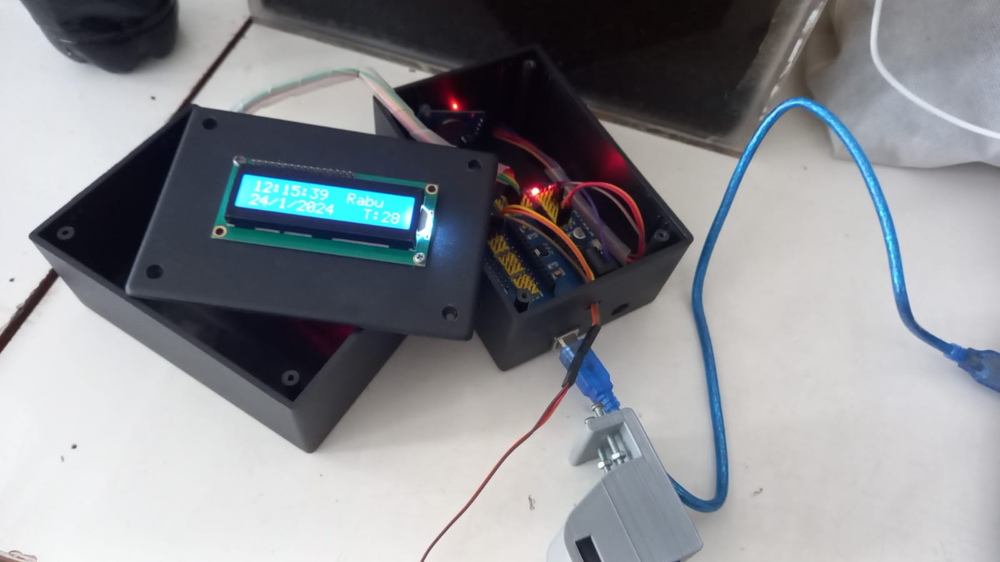
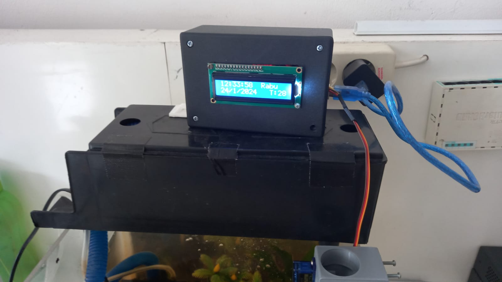

# Pemberi Pakan Ikan Otomatis (Automatic Fish Feeder)

Alat pemberi pakan ikan otomatis berbasis Arduino Uno yang membuka penampung pakan secara terjadwal menggunakan RTC (Real Time Clock). Cocok untuk kolam atau akuarium yang perlu diberi makan rutin tanpa harus dilakukan manual setiap hari.

Project ini dibuat untuk dipamerkan pada acara **Pekan IT** semasa di SMK Plus Pelita Nusantara tahun 2024

## Fitur

- Mendukung hingga **6 jadwal makan per hari**
- Penjadwalan waktu presisi menggunakan modul **RTC DS3231**
- **LCD I2C 16x2** menampilkan jam, hari, tanggal, dan suhu ruangan secara real-time
- **Servo motor** membuka dan menutup pintu pakan secara otomatis saat jadwal tiba
- Jadwal makan **tersimpan di EEPROM**, jadi tidak hilang meski Arduino mati/restart
- Log status ditampilkan melalui Serial Monitor untuk debugging

## Komponen yang dibutuhkan

| Komponen | Jumlah | Keterangan |
|---|---|---|
| Arduino Uno | 1 | Mikrokontroler utama |
| Servo motor SG90 | 1 | Membuka/menutup pintu pakan |
| LCD I2C 16x2 | 1 | Alamat default `0x27` |
| Modul RTC DS3231 | 1 | Penyimpanan waktu, tetap akurat meski Arduino mati (baterai coin cell) |
| Kabel jumper | secukupnya | |
| Wadah/corong pakan + mekanisme pintu | 1 set | Digerakkan oleh servo |

## Skema sambungan (wiring)

| Komponen | Pin | Terhubung ke Arduino |
|---|---|---|
| Servo motor | Sinyal | D4 |
| Servo motor | VCC | 5V |
| Servo motor | GND | GND |
| LCD I2C | SDA | A4 |
| LCD I2C | SCL | A5 |
| LCD I2C | VCC / GND | 5V / GND |
| RTC DS3231 | SDA | A4 (bus sama dengan LCD) |
| RTC DS3231 | SCL | A5 (bus sama dengan LCD) |
| RTC DS3231 | VCC / GND | 5V / GND |

> LCD dan RTC sama-sama memakai jalur I2C, jadi SDA disambung paralel ke SDA, dan SCL disambung paralel ke SCL.

## Instalasi

1. Install Arduino IDE (jika belum ada).
2. Install library berikut lewat **Library Manager**:
   - `LiquidCrystal_I2C`
   - `Sodaq_DS3231`
   - `Servo` (biasanya sudah bawaan Arduino IDE)
3. Clone/download repo ini.
4. Buka file `.ino` di Arduino IDE.
5. Sambungkan Arduino Uno ke komputer, pilih board dan port yang sesuai.
6. Upload sketch ke Arduino.

## Mengatur jadwal makan

Jadwal makan diatur lewat variabel `waktuMakan1` sampai `waktuMakan6` di bagian atas kode:

```cpp
DateTime waktuMakan1 = DateTime(0, 1, 1, 10, 52, 0, 0); // jam 10:52
```

Ubah angka jam dan menit sesuai kebutuhan, lalu upload ulang. Setelah pertama kali diunggah, jadwal ini otomatis tersimpan ke EEPROM.

## Mengatur waktu RTC pertama kali

Modul RTC perlu di-set sekali di awal supaya jam/tanggalnya akurat. Di dalam `setup()`, cari baris berikut, hapus komentarnya (`//`), isi dengan tanggal & jam saat ini, upload sekali, lalu komentari lagi:

```cpp
DateTime dt(2020, 10, 17, 20, 03, 0, 7); // tahun, bulan, tanggal, jam, menit, detik, hari (1=minggu, 7=sabtu)
rtc.setDateTime(dt);
```

## Catatan / troubleshooting

- Jika LCD tidak menyala/blank, alamat I2C mungkin bukan `0x27` — coba scan alamat I2C dan ganti sesuai hasilnya (umumnya `0x3F`).
- Jumlah gerakan servo buka pakan bisa disesuaikan lewat variabel `waktuBukaServo`, `servoBuka`, dan `servoTutup` di bagian atas kode.

## Dokumentasi alat

Berikut hasil jadi alatnya — enclosure berisi Arduino, RTC, dan LCD I2C yang menampilkan jam, hari, tanggal, dan suhu secara real-time, terpasang di atas boks pakan dengan servo penggerak pintu pakan:




## Lisensi

Bebas digunakan dan dimodifikasi untuk keperluan pembelajaran/non-komersial.
